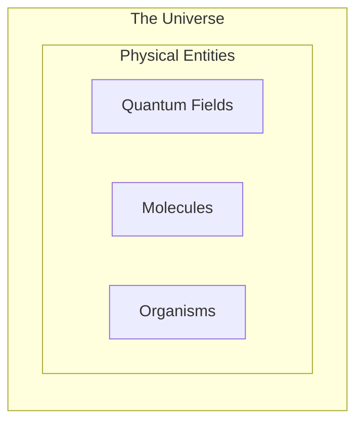
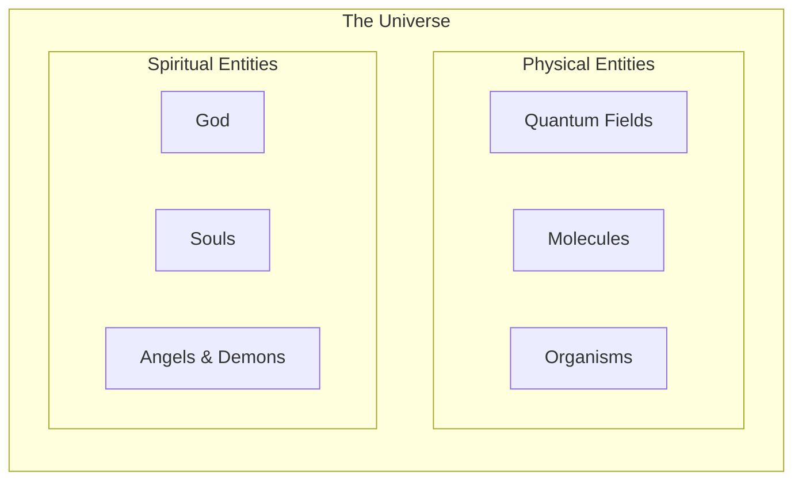
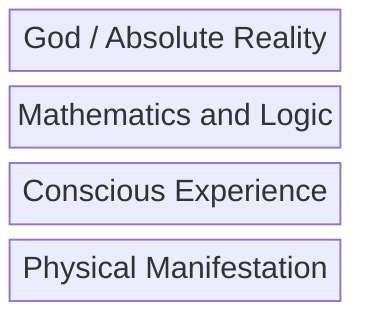

# Introduction
I am interested in clarifying my own personal metaphysic of reality. I found the book *Seven Brief Lessons in Magic* by Paul Tyson to be extremely helpful here.

# Supernaturalism and Physicalism

My first argument is that Christianity and the Atheist have far more in common than one might originally think. Let us sketch the metaphysic of each. When I say Christian and Athiest, I am referring to the typical modern version of each in the West. There is much diversity in both camps and none of these points are referring to all Christians or all Atheists.

The Atheist represents reality as a collection of physical objects. One uses empiricism to deduce and understand the structure of physical reality. These objects are nothing more than complex arrangements of quantum fields.

The Christian agrees with this ontology except they also posit there exists a distinct set of supernatural entities that can interact with and are affected by physical entities. For example, souls interact with human brains or God interacts with material reality.

The only disagreement here is whether or not there is evidence for the existence of spiritual entities. Both sides are nominalist when it comes to matter. This means that both sides would agree that the physical objects we see around us are really nothing more than complex arrangements of matter. The Atheist explains there existence by appealing to the laws of nature and evolution whereas the Christian would also allow for divine intervention.

# The Problem

As someone looking for spiritual meaning in the world, I find this approach to be problematic for the Christian for a few reasons.

First, this approach is a god of the gaps argument. One's credibility to believe in the supernatural depends on the adequacy of science to explain a particular phenomena. The problem of course is that that such any given physical phenomena may be explained by the scientific community in the future.

Second, this approach reduces God to just another entity in the universe. This conception of God is nothing more than an abstract version of Zeus. The reason this matters is that many deep philosophical questions are left unanswered. For example, why does God exist? Why does he have the properties he does?

What we are left with uncertainty as to whether we can believe in god that may or may not explain everything anyway!

# Diving Deeper

All is not lost! There are a series of questions that I believe can help us solve both of these problems. What makes these questions unique is that they are extra-scientific and are immune to being answered by future discoveries.

1. Why is there something rather than nothing?
2. Why does our universe have the properties it does?
3. Why does phenomenal consciousness exist?
4. Why do phenomenal experiences have the qualities they do?

The first two questions are about objectivity whereas the last two are about subjectivity.

Regarding the first two questions, I argue that science can only seek to understand the universe *as it is given to us*. I think one can misunderstand this point and say that every property of our universe can be explained. For instance, one might argue: "Well, we live in a multiverse that underwent a selction process for life and hence here we are!" But this fails to explain why the multiverse exists. I'm not interested in what precedes the universe or comprises it. I am speaking specifically to it's raw and existence.
 
A similar explanation is warranted for the last two questions. One might appeal to neuroscience or evolutionary biology to explain the structure and contents of our mental experiences. I find these to be woefully lacking in helping me understand why these experiences feel the way the do! Yes, we can develop accurate models of our sensory experiences. But why are vision and touch feel so different even though they are geometric in nature? This is a brute fact of our reality from the scientific perspective. 

# An Enchanted World

My solution is to reposition God not as just another entity but the ground of being itself. It is hard to describe this position directly so I will offer some statements that provide clarity. The strategy shifts from trying to collect evidence of supernatural interventions and shifts towards identifying layers of reality that coexist and are intangled with one another. Such layers include, phenomonlogical experience, mathematics and reason, physical entities, and being itself.

I am less concerned with neatly dividing reality into distinct layers than I am in identifying that there is more going on than just physical stuff. The reductionist would posit all these layers are just complicated descriptions of the material stuff. I don't buy this.

My intution suggests that reality is fundamentally qualitative. There are certain principles that define and constrain our reality.

I think I am losing energy here but I will continue this later!